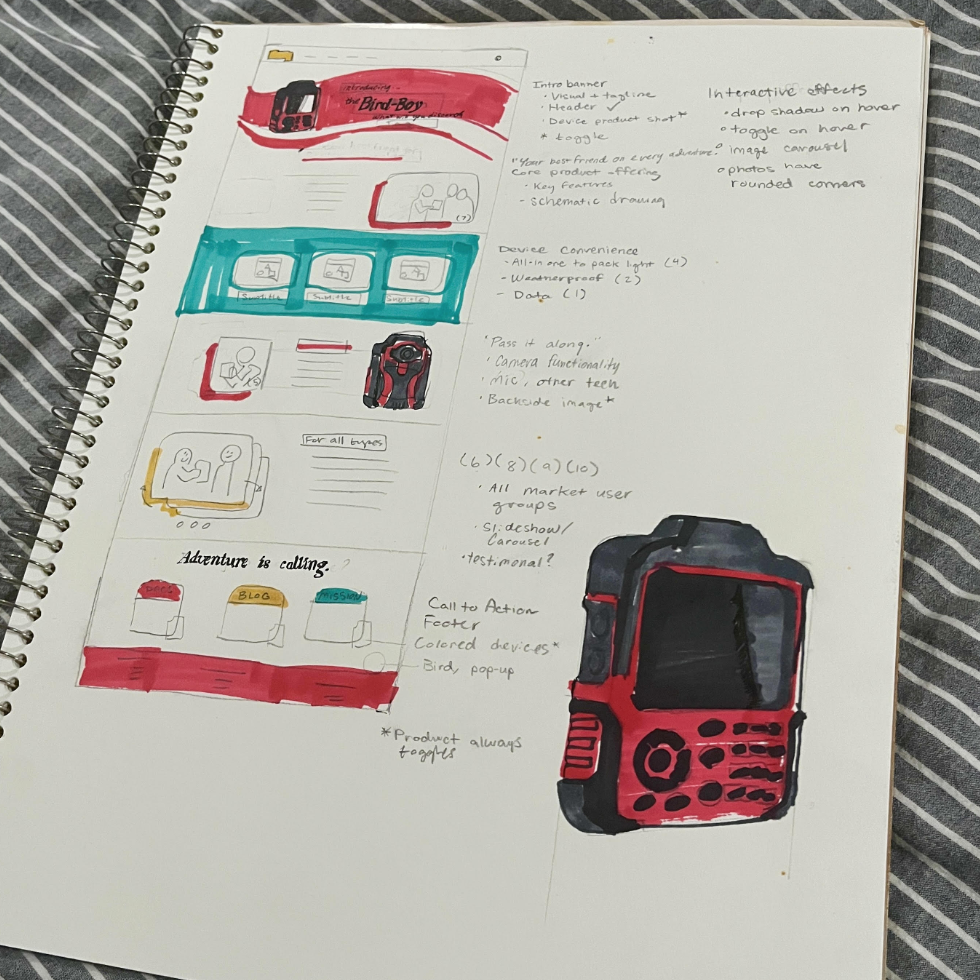

# Bird Boy Product Showcase

The Bird-Boy is a conceptual handheld device for which I created an entire product website via Docusaurus. The project was meant to combine a multivaried skillset of marketing, branding, technical writing, and design into a cohesive product identity. You can check out the actual website [here](https://bird-boy.brett-studer99.workers.dev/), which will include the following assets (all developed by me personally):

* Website architecture, including a fleshed-out landing page, using Docusaurus framework
* Conceptual product render and lifestyle photography images, constructed with Google Gemini and Adobe Photoshop
* Technical user docs that showcase the device's functionality and troubleshooting
* Promotional blog articles that highlight the device's key use cases
* Mission statement from the product manufacturer that serves as an extension of the brand identity
* Style and branding guide which adds cohesiveness to the entire site across all its properties

## Conception

As a long-time outdoors enthusiast, I have been using handhelds and apps to track research projects, as well as in my personal hobbies as well. I know I'm not the only one. Species tracking apps like [Merlin Bird ID](https://merlin.allaboutbirds.org/), as well as recreational games like [Geogaching](https://www.geocaching.com/play) and [Pokémon Go](https://www.pokemongo.com/), have all gathered avid user bases who represent a demographic interested in expanding their knowledge of biodiversity or just gamifying the great outdoors. From there, I conceived an all-in-one package for all types of users: birders, foragers, students, and researchers alike. I saw a crossroad between this product concept and my existing skills as a documentation writer and aspiring web and product developer. From this eureka, I began to plan.

## Planning

Building an end-to-end product showcase required a good degree of foresight, including knowing which skills I could leverage easily and which skills would require some fundamentals along the way. Docusaurus is a popular static site generator (developed by Meta), which supports native JS React elements, as well as built-in documentation and blogging components. I decided it would make an excellent framework for my project.

From here, I put together a list of all assets the site would need to fully ship. This went beyond just an idea and some docs; it required clear messaging about why this product (hypothetically) exists, who it's for, and the greater identity of its manufacturer, BREW Methods. I knew early on that I had my work cut out for me.

## Execution

One of the first and most critical aspects of bringing this product to life was the product mockup. This required a lot of deliberation on my part, as I wasn't simply looking for any little gizmo or gadget to be the face of this project. It needed to be functional. It needed to represent a clear market niche, and the design therefore needed to be reflective of its offering. I used Google Gemini's Nano Banana 2 for my initial rendering, and in this phase I decided what this device should be, and what it shouldn't. Early mockups looked like a piece of construction site or warehouse facility equipment; too technical and too bland. Other designs appeared too sleak and delicate, not like something that could withstand a slog through the rain and the mud.

  

  

  

What I eventually decided I liked were tactile textures, rubber and silicone coming together to form the exterior, and physical buttons that could outperform touch screens under harsh conditions. Once I had assets I liked, I took them to Adobe Photoshop to add fine touches. This product render would be a critical part of the project, manifesting ephemeral notions into a tangible direction for the rest of the project.

From there, Google Gemini was able to insert this product render into marketing and lifestyle photography. I wanted to push my knowledge of AI image generation to build a dedicated campaign to this product. Now audiences wouldn't just see a proof of concept, they would see the real-world applications of this device. Families with small children huddled around the device, an elderly couple using the device from the comfort of their home, friends trekking through the mud and the rain: all of these different demographics now had a place in our target audience. Accessibility and discovery were two of the biggest themes in creating all the assets for the site.

With these images and a dedicated style and branding guide, which established key branding colors, fonts, and messaging, I was able to develop the landing page. Understand this was not just blindly throwing darts at Claude Code. I conceived the overall shape of the landing page with pens and markers, on paper, before I even touched my keyboard. I consider myself a hobbyist visual designer, and was pleased I could make use of it in this showcase execution. Though I'm not a dedicated frontend designer, this is one of the areas I felt I could dedicate way too much time perfecting and making more use of Docusaurus' React support to create a fully interactive homepage. However, I needed to keep moving forward.

  

Next, I developed the web assets. The documentation was constantly iterative; with each new feature I conceived, complimentary components seemed only natural to include. The docs began to come alive. While I opted out of a fleshed out UI showcase, there is a cohesion of the different apps within the device, working together to make your adventures something special and memorable. The three key device modes: Maps, Database, and Discover, all unite to build a network of biology and geography which can be shared. The blog helped personalize the brand's style and also showcase real world scenarios where you might take this device with you instead of a standard smartphone. AI had a helping hand outputting raw content, but I made sure that everything met my par of quality and reflected the values and voice of BREW Methods.

### Development Stack

| Asset/Function | Description |
|---|---|
| Site generation | GitHub, Docusaurus |
| Web hosting | Cloudflare Pages |
| Image generation | Google Gemini, Adobe Photoshop |
| Docs + blog | Google Gemini, Markdown |
| Landing page | Claude Code, HTML + CSS |

## Results

In its final stages, I'm very excited that I was able to bring concepts of an app into a fully-fledged piece of hardware with its own technical docs and brand awareness. This is more than just a vibe-coded app wrapper, it's an exercise in brand messaging. I specifically avoided modern web layouts and aesthetics, including for the device itself, to achieve a look that feels retro, primary, and ultimately classic. A timeless and heartfelt offering, symbolizing BREW Methods' larger commitment to the environment around us. If this concept piqued your interest, or you have extra thoughts about the project and its execution, please contact me!
