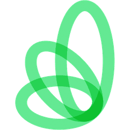
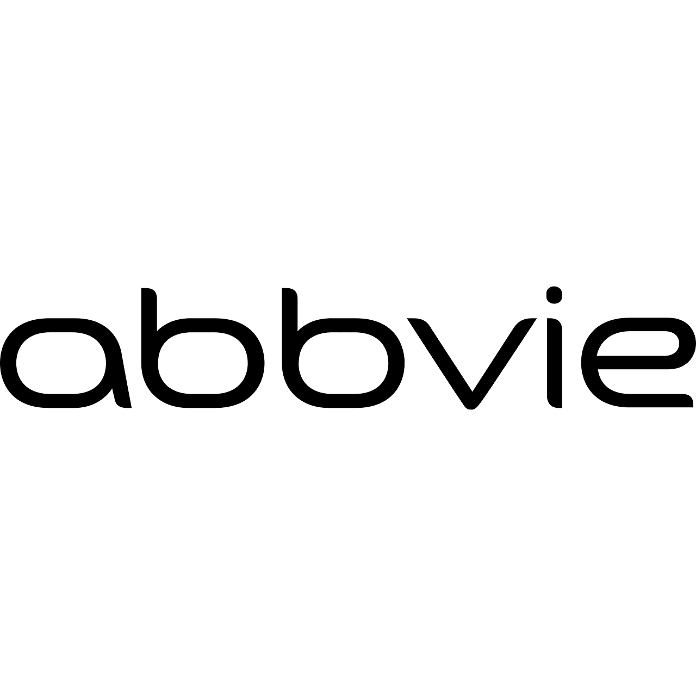

# Experience

    

        
        

            <h3>Arine, <i>Technical Writer</i></h3>
            <h4>April 2025 - March 2026</h4>
            
Sole technical writer for a healthcare optimization platform serving pharmacists and clinicians. Migrated the knowledge base from static PDFs into Document360, cutting content turnaround time by more than half, and built a AI writing tool to audit style-guide compliance and flag content needing updates from Jira-tracked feature work.

        

    

    

        
        

            <h3>Kubecost, <i>Technical Writer</i></h3>
            <h4>June 2022 - June 2024</h4>
            
Maintained documentation repo as solo technical writer, working closely with developers and product managers to release dev-focused software docs. Helped migrate knowledge base into GitBook, provided training and contribution guidelines for team members to boost collaboration, and ultimately improved docs pipeline with automation and health checks.

        

    

    

        
        

            <h3>MobiledgeX, <i>Technical Writer</i></h3>
            <h4>June 2021 - May 2022</h4>
            
Wrote and maintained API and product documentation in Statamic for an edge-computing startup serving mobile gaming and IoT developers, and produced Adobe Photoshop graphics for the docs site and external messaging at the 40-person company.

        

    

    

        
        

            <h3>OpenMRS, <i>Technical Writer and Google Season of Docs Participant</i></h3>
            <h4>May 2021 - November 2021</h4>
            
Partnered with open-source medical records organization OpenMRS as part of Google's Season of Docs fellowship program to help streamline new member onboarding and generate page templates for Confluence knowledge base.

        

    

    

        
        

            <h3>AbbVie, <i>Digital Communications Intern</i></h3>
            <h4>September 2019 - August 2020</h4>
            
Developed internal training and onboarding materials including documentation and video scripts, as well as office newsletters and promotional articles for healthcare concepts and solutions.

        

    

## Projects & Contributions

    

        
        

            <h3>Modular AI-Leveraged Video Script Library</h3>
            
File-based project structure to support AI-leveraged video script generation and text-to-speech, including an end-to-end publishing process.

        

    

    

        
        

            <h3>Bare-Metal Linux Homelab with Gaming Server</h3>
            
Repurposed an old laptop into a headless Ubuntu server, containerizing a gaming server with Docker and exposing it to friends via port forwarding and dynamic DNS. Configured host firewall, key-based SSH, intrusion prevention, and automated backups.

        

    

    

        
        

            <h3>Quality-Gating My Own Portfolio</h3>
            
Built a docs-as-code CI/CD pipeline for this MkDocs portfolio using automated jobs via GitHub Actions on every pull request, plus automated per-PR preview deploys.

        

    

    

        
        

            <h3>Full-Stack App Deployment with GCP</i></h3>
            
Deployed a containerized to-do app to a private GKE cluster using Terraform for IaC and GitHub Actions for CI/CD, with a GCP-hosted MongoDB backend and automated object-storage backups. Presented the full architecture and security reasoning to a technical panel as part of a Wiz interview assessment.

        

    

    

        
        

            <h3>FitNotes, <i>Documentation Contributor</i></h3>
            
Updated MkDocs web documentation for iOS workout app I personally use after meeting with the app's support team. Changes include updated contact info, streamlined release notes, and standardized language.

        

    

    

        
        

            <h3>Bird-Boy Product Showcase</h3>
            
Designed and built a full product site in Docusaurus for a conceptual outdoor-navigation handheld device, generating product renders and lifestyle photography with Google Gemini and Adobe Photoshop, and building the landing page with Figma and Claude Code. Includes technical docs, blog, style guide, and brand mission statement.

        

    

## Technical Skills

### Software and Tooling

* **Documentation**: Markdown, MkDocs, Docusaurus, HTML, CSS, Document360, Statamic, GitBook
* **Development**: GitHub, Microsoft Office, Google Gemini, Claude Code, GCP, AWS, Jira, Postman, Kubernetes, kubectl, helm, Cloud Service Providers, Docker, Linux (Ubuntu), Visual Studio Code, Zendesk, cURL, JSON, Stoplight, Fern, VirtualBox, MySQL
* **Design**: Adobe Photoshop, Adobe Illustrator, Adobe Creative Cloud, Microsoft Visio, Figma, draw.io, SnagIt, Mermaid

### Processes and Workflow

* **Processes**: QA testing, version control, documentation architecture, content migration, open-source contributions
* **Methodologies**: Agile, Scrum, docs-as-code, Diataxis framework, ASD-STE100
* **Content Types:** Product/software documentation, API docs, release notes, style guides, blogs, onboarding and installation guides, architecture diagrams, graphic design

### Certifications

* Postman, *Postman API Fundamentals Student Expert* (November 2025)
* FinOps Foundation, *Introduction to FOCUS* (May 2024)
