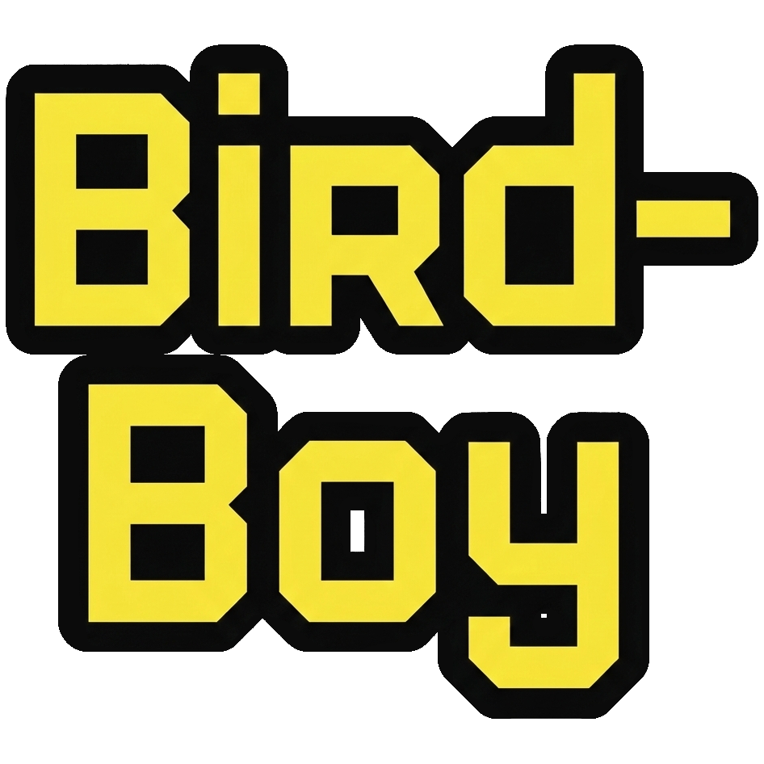

<h1>Welcome to my portfolio!</h1>

My name is Brett, and I help teams build docs from foundation to scale.

 

## My Work

I’ve spent years helping companies find their voice through documentation. In both software and healthcare, including tiny startups, I’ve come aboard when docs were little more than some scattered internal notes and a couple slide decks. I turned that chaos into structure and strategy. I’ve led tool migrations, defined contributon guidelines, and shaped writing standards that help companies sound like themselves. Every project has had its own set of documentation dilemmas, but solving them has always meant the same thing: creating clarity where there wasn’t any before.

    

        
        

            <h3>Arine, <i>Technical Writer</i></h3>
            <h4>April 2025 - Present</h4>
            
Building out documentation for a dense knowledge base in a SDLC requiring flexibility and decisiveness. Orchestrated large-scale content migration into Document360.

        

    

    

        
        

            <h3>Kubecost, <i>Technical Writer</i></h3>
            <h4>June 2022 - June 2024</h4>
            
Maintained documentation repo as solo technical writer, working closely with developers to build docs with a monthly software release schedule. Helped migrate knowledge base into Gitbook and provided training and contribution guidelines for team members to boost collaboration.

        

    

    

        
        

            <h3>MobiledgeX, <i>Technical Writer</i></h3>
            <h4>June 2021 - May 2022</h4>
            
Documented edge computing software product including API documentation, and generated graphic designs to showcase product utility and function.

        

    

    

        
        

            <h3>OpenMRS, <i>Technical Writer and Google Season of Docs Participant</i></h3>
            <h4>May 2021 - November 2021</h4>
            
Partnered with open-source medical records company OpenMRS to help streamline new member onboarding and generate page templates for Confluence knowledge base.

        

    

## Projects

    

        
        

            <h3>Bird-Boy Product Showcase</h3>
            <h4>February 2026</h4>
            
Full product showcase for conceptual nature and navigation handheld device, built in Docusaurus. Includes style and branding guidelines, product imagery, technical docs, blog, and brand mission statement.

        

    

## Technical Skills

### Software and Tooling

* **Documentation**: Markdown, Mkdocs, Docusaurus, HTML, CSS, Document360, Statamic, Gitbook
* **Development**: Github, Microsoft Office, Google Gemini, Claude Code, Jira, Postman, Kubernetes, kubectl, helm, Visual Studio Code, Zendesk, cURL
* **Design**: Adobe Photoshop, Adobe Illustrator, Figma, draw.io, SnagIt, Mermaid

### Processes and Workflow

* **Processes**: QA testing, version control, documentation architecture, content migration, open-source contributions
* **Methodologies**: Agile, Scrum, docs-as-code, Diataxis framework
* **Content Types:** Product/software documentation, API docs, release notes, style guides, blogs, onboarding and installation guides, architecture diagrams, graphic design

### Certifications

* Postman, *Postman API Fundamentals Student Expert* (November 2025)
* FinOps Foundation, *Introduction to FOCUS* (May 2024)

## About This Portfolio

I developed this portfolio to demonstrate proficiency with syntax languages, static site generators, and version control tooling. The result is a simple, clean portfolio site that serves as a constantly-evolving sandbox for me to continue building my web dev skills.

| Criteria | Tooling |
|---|---|
| Web hosting | GitHub pages |
| Site generation | Mkdocs Material |
| Markup languages | Markdown, HTML + CSS |

### Migration to Zensical

If you're an avid user or contributor of static site generators, then you may have heard [updates and maintenance of Mkdocs have largely been discontinued](https://fpgmaas.com/blog/collapse-of-mkdocs/). At this time, there are numerous successors vying to take its place, all with their own varying degrees of accessibility and development. So far, [Zensical](https://zensical.org/) has emerged as a legitimate contender (built by many of the same people who helped create Mkdocs), but is still early in supporting all of Mkdocs' functionality and plugins. I considered whether using Mkdocs for my portfolio could be an eventual liability, but at this time, I have concluded not to migrate my portfolio at this time to Zensical or another similar platform. Zensical still ingests `mkkdocs.yml` files, and generates a largely similar frontend. Therefore, switching over will only take minutes and is not warranted (for now).

## First Visit?

I recommend to new visitors to start with my [Kubecost](kubecost/kubecost-overview.md) and [MobiledgeX](mobiledgex/mobiledgex.md) projects for a deep look into my professional work with both writing and design samples.
