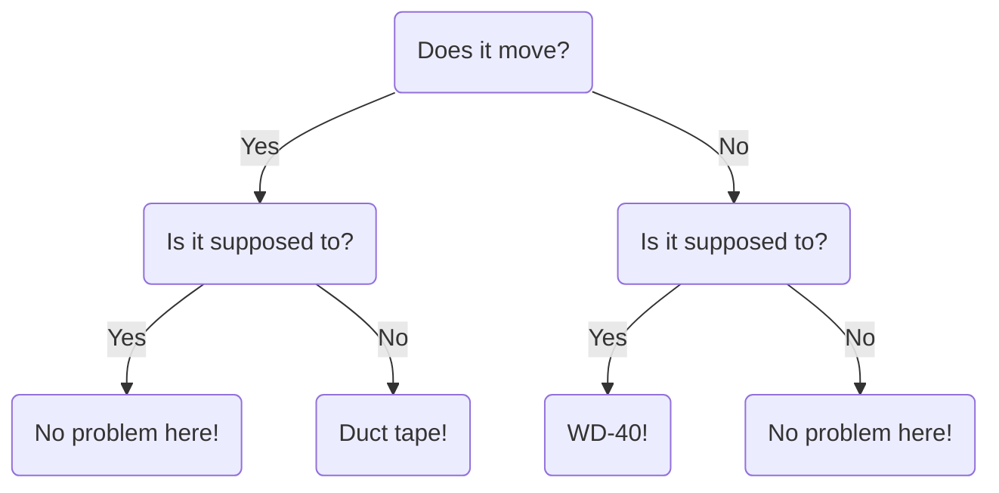

# Engineering Flowchart

!!! info "Author's Note"

    The following is a humorous demonstration of Mermaid, a tool for generating flowcharts directly in documentation, by recreating a long-circulated "Engineering Flowchart" graphic for troubleshooting.

