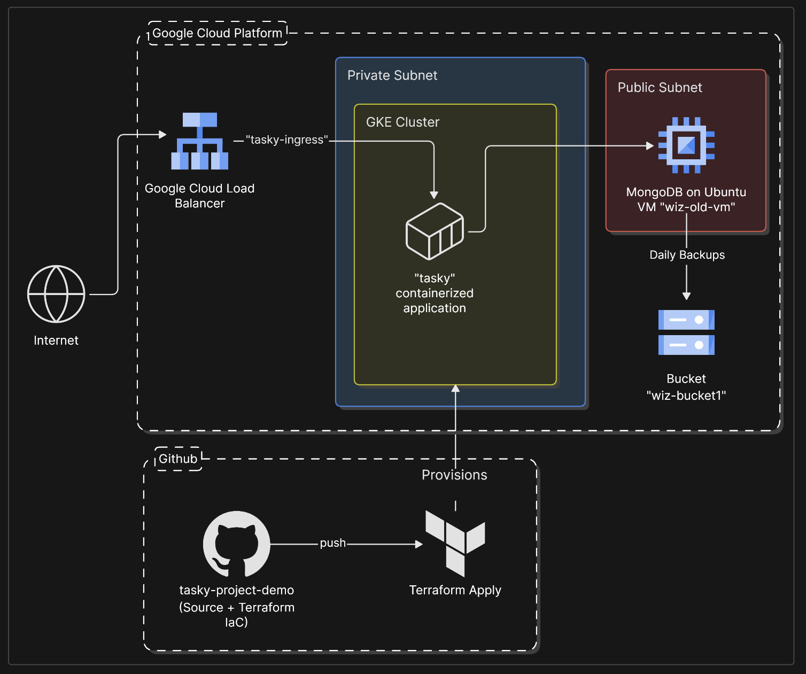
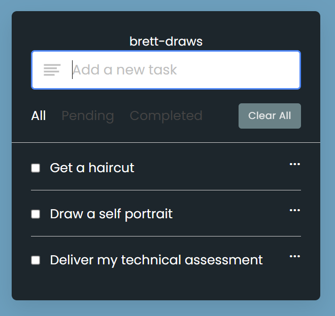
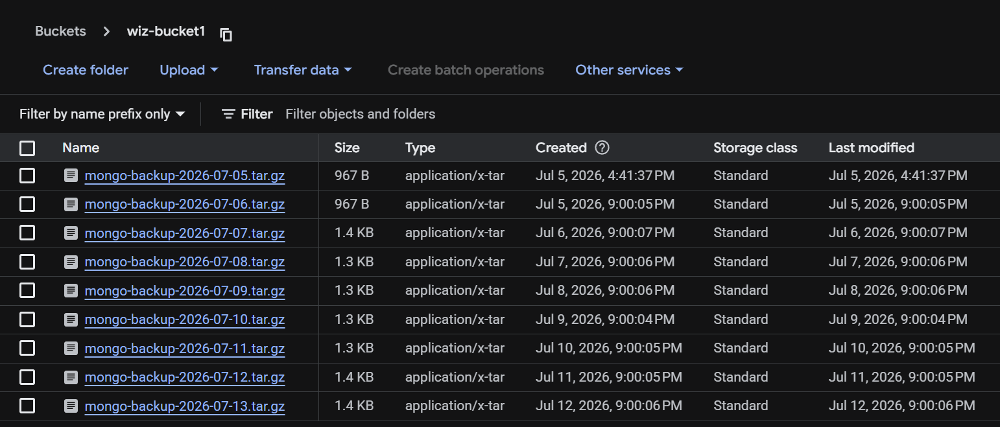
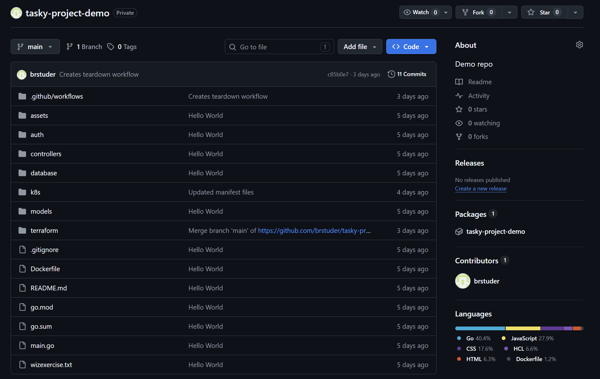

# Full-Stack App Deployment with GCP

This project showcases a full-stack cloud infrastructure build on Google Cloud Platform: deploying a containerized Kubernetes application, layering in Infrastructure-as-Code and CI/CD automation. It was part of a technical assessment I underwent while interviewing for a role at Wiz. I delivered this project, along with a full architectural and security breakdown, to an internal panel as part of that process.

The project touches the core disciplines expected of a modern cloud/DevOps engineer: compute and network provisioning, Kubernetes deployment and RBAC, IAM and least-privilege reasoning, Infrastructure-as-Code, CI/CD pipeline design, and cloud-native security monitoring. I touched on all these concepts in my presentation, demonstrating the functional app in a live cloud environment.

## Overview

As this architecture diagram shows, the key components of my project include:

* To-do list application ("tasky"), provided as part of the assignment, containerized via a Dockerfile and built into a minimal production image
* A private GitHub repository hosting the app source code as well as other key project files
* Terraform files within the repo to codify key cloud resources
* GitHub Actions CI/CD pipelines to build and teardown the IaC resources
* A private GKE cluster to run the application
* A GCP virtual machine running Ubuntu, hosting a MongoDB server that collects user data from the tasky app
* An object storage bucket which the MongoDB server writes automated backups to on a daily interval, via a scheduled cron job
* A Kubernetes Ingress resource which automatically provisions a genuine Google Cloud external Load Balancer, exposing the application's frontend to the public internet while the underlying cluster nodes remain fully private

### Managing User Data

Here is a screenshot of the "tasky" application.

The app persists to-do list items, added by users through its frontend, to a MongoDB server via a database connection string. That MongoDB server writes a full backup to an object storage bucket on daily intervals via an automated cron job. Below is a GCP screenshot which shows a bucket receiving daily backups.

### Hosting App Files

Here is the private GitHub repository I created. The contents of the repo include:

* Application source code and its Dockerfile
* Kubernetes manifest files
* IaC Terraform files
* GitHub Actions workflow `.yml` files, including environment setup, application build/deploy, and infrastructure teardown

## Key Takeaways

This project reflects the kind of work that shows up daily in cloud/DevOps environments, and it's a useful reference point for both hands-on infrastructure work and for writing clear technical documentation about that work.

**Infrastructure-as-Code and CI/CD.** I deployed a meaningful portion of this project in Terraform and GitHub Actions workflows. This enables rapid development and destruction of cloud environments, all in one place as opposed to manual, step-by-step configuration of every component, helping projects scale architecture instead of bloating man hours.

**Security as a design constraint.** Rather than treating vulnerabilities and controls as separate topics, this project pairs specific misconfigurations with the actual attack path each one enables. Being able to explain *why* a given configuration is risky, not just flag that it exists, is exactly the kind of reasoning that separates checklist-driven security work from fundamental understanding.

**Debugging real, non-obvious failures.** Several of the most valuable moments in this project came from things going wrong. In many ways, debugging and troubleshooting these problems as they occurred facilitated a real-world learning environment where I did not have to fear failure or setbacks. It provided a glimpse into the world of product testing and QA.

**Clear technical communication under scrutiny.** I ultimately delivered this project live to a technical panel, which meant not just meeting the project's outlined criteria, but being able to demonstrate my knowledge of multiple technical domains, as well as being able to articulate why I made certain choices or arrived at certain technical understandings.