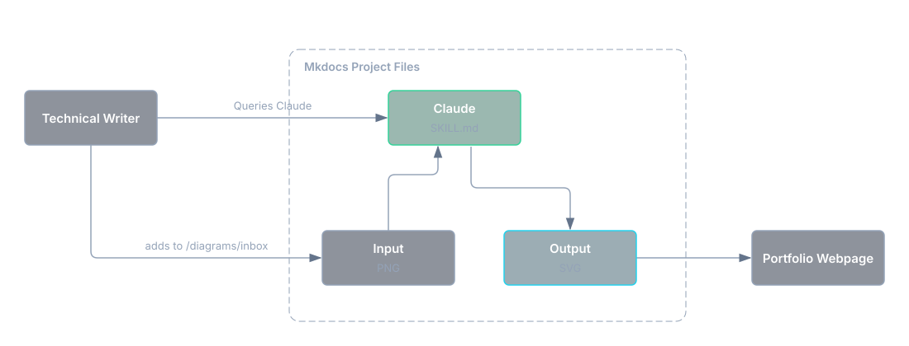

# Scalable Architecture Diagrams with Excalidraw and Claude

Similar to my project on [video script generation](video-script.md), I wanted to experiment with a modular file system to support content generation, this time focusing on a visual process, architecture diagrams.

Having worked in SaaS startups where I was performing multiple types of content generation across documentation and knowledge bases, I understand the tedium of constantly updating and replacing images and diagrams which outline technical concepts. This solution helps create a standardized process for maintaining those diagrams over time.

## Advantages

This project allowed me to address some common challenges of content authoring, and provides these benefits:

* Output as SVG allows diagrams to be read and updated over time by AI, including text and other components, an advantage not necessarily available for PNG format. This is helpful for organizations looking to keep a library of diagrams that may readily change.
* Adherence to a single style guideline allows consistent output of content across an entire library, maintaining a uniform visual style.
* Centralizing all knowledge content with the diagram content pipeline allows you to reference specific content from your docs to your AI, as opposed to describing all components from scratch. It establishes a baseline of context which may be necessary for excessively technical interactions.

## Modifying Open-Source Skills

For any AI skill you are looking to implement for basic, reusable processes, it's often better to search for what's already publicly available than building your own from scratch. For this process, I sampled existing diagram skills from GitHub, and decided to use [Cocoon AI's Architecture Diagram Generator](https://github.com/Cocoon-AI/architecture-diagram-generator) as a starting point. However, there were some important changes to implement to the project's `SKILL.md` file to better suit my workflow:

* Changing output from inline HTML to SVG
* Visual changes including transparent backgrounds, larger text size, specifying and hosting my own local font, etc. to generate a style and palette guide
* Removing the legend and other superfluous elements which reduced overall readability
* Providing a local set of visual assets including dark mode compliant logo icons (more on this later)

My changes result in a simpler, more compact output. No need to reinvent the wheel (just heavily tailor it first). For organizations with specific style components and palette requirements, I would recommend creating an asset in `.claude/skills/architecture-diagram/resources/` which contains those requirements.

## Responsive Light/Dark Mode Mapping

As an additional visual component which requires consistent color and style output of diagrams, I have implemented a filter on my portfolio which allows images to responsively swap between light and dark mode. The benefit of this configuration is that it does not require separate light and dark mode versions of each image.

[Diagrams I generated for Kubecost](../samples/diagrams.md) now appear on [IBM's web domain](https://www.ibm.com/docs/en/kubecost/self-hosted/3.x?topic=kubecost-core-architecture-overview), with this filter applied post-acquisition. It applies across all images on the site, including architecture diagrams and UI screenshots. I reverse engineered the process with Claude, and adapted it to my own website via CSS. This implementation is manual per image, not applied sitewide (there are lots of images in my portfolio which are not suited well against this process).

The solution involves this additon to `style.css` which establishes inversion, but also includes hue rotation for color elements (which are plentiful in these architecture diagrams):

``` title="style.css"
[data-md-color-scheme="slate"] .md-content img.dia-light {
  filter: invert(100%) hue-rotate(180deg);
}

[data-md-color-scheme="default"] .md-content img.dia-dark {
  filter: invert(100%) hue-rotate(180deg);
}
```

An additional tag then needs to be applied per image:

```
{: .dia-dark }
```

The `{: .dia-dark }` tag assumes the image it modifies is meant for dark mode, so it only applies inversion when light mode is selected. Swap this to `{: .dia-light }` for images on light backgrounds.

## Content Pipeline

With a revised `SKILL.md` file, a visual style to adhere to, and a location to implement local assets (fonts and diagram mockups), I had everything necessary to put together my content pipeline. The files were implemented directly in my Mkdocs website, with the following structure (this does not represent the entire repository, just the relevant files):

```
mkdocs-portfolio/                               # repo root (holds mkdocs.yml)
├── mkdocs.yml                                  # Site-wide config file 
├── CLAUDE.md                                   # Repo-wide conventions for Claude Code
├── requirements-dev.txt                        # pip dependencies for diagrams
├── .gitattributes                              # Marks docs/images/diagrams/*.svg as generated output
├── .claude/
│   └── skills/
│       └── architecture-diagram/
│           ├── SKILL.md                        # Modified Cocoon AI skill to reflect my use case better
│           └── resources/
│               ├── build.py                    # Builds and validates content + components
│               ├── make_metrics.py             # One-time script to restore font-metrics.json
│               ├── font-metrics.json           # Ensures typeface is compliant with style guide
│               └── template.svg                # Starter template to model off of
├── diagrams/
│   ├── src/                                    # Pre-built SVG content to be sourced for diagrams
│   └── inbox/
│       └── input.png                           # Mockup diagram ingested by Claude which only describes orientation of graph
└── docs/
    ├── assets/
    │   └── fonts/
    │       ├── inter-latin-400-normal.woff2    # Self-hosted Inter (regular)
    │       ├── inter-latin-600-normal.woff2    # Self-hosted Inter (semibold)
    │       └── LICENSE.txt                     # SIL Open Font License covering the bundled Inter files
    ├── stylesheets/style.css                   # Sitewide CSS file, contains light/dark mode inversion
    └── images/
        └── diagrams/                           # Output folder for completed diagrams
```

## Managing Inputs and Outputs

For diagramming, I expected some degree of manual involvement. I originally started this project looking to leverage an Excalidraw MCP to describe and generate diagrams, manually editing them in Excalidraw afterwards, instead I opted for Excalidraw merely as a starting point, rendering the components positionally and exporting it as a PNG. A PNG is saved to `/diagrams/inbox`, and I then point to that file when I invoke the `SKILL.md`. Here is an example output showcasing this pipeline:

{: .dia-dark }

Once I end up with an SVG that is publishable, Claude deletes the initial input, while still possessing the finished SVG which can be subject to future modifications.

## Troubleshooting

### Responsible token usage

Token usage was exceptionally high on test runs. For any AI-leveraged content creation beyond plaintext, effective token consumption is a key skill to manage. In this case, the highly granular positioning of diagram components was eating large amounts of resources, and would still require successive iterations. I took time to downscale the total context required to build, and repeatedly had to revise the build pipeline to run smoother. This required ultimately more initial manual development of diagram structure, providing Excalidraw-rendered mockups as input, while the Claude skill output clean diagrams that adhere to the style guide.

### Visual uniformity

Diagram components were additionally being created in a repetitive, rectangular array which is visually plain. Instead of hyper-specific prompting to explain each element, its properties, and its positional relations, the same solution for token consumption applied here: manual diagram creation via Excalidraw.

