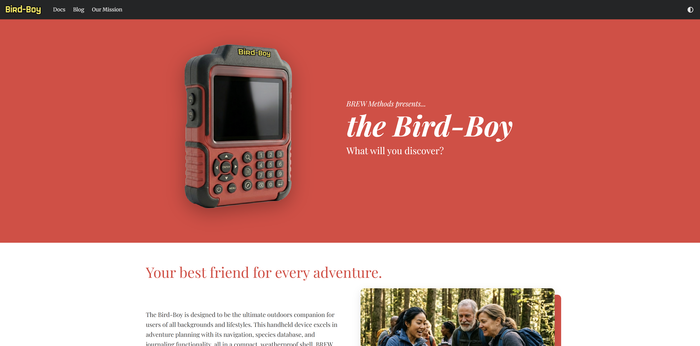
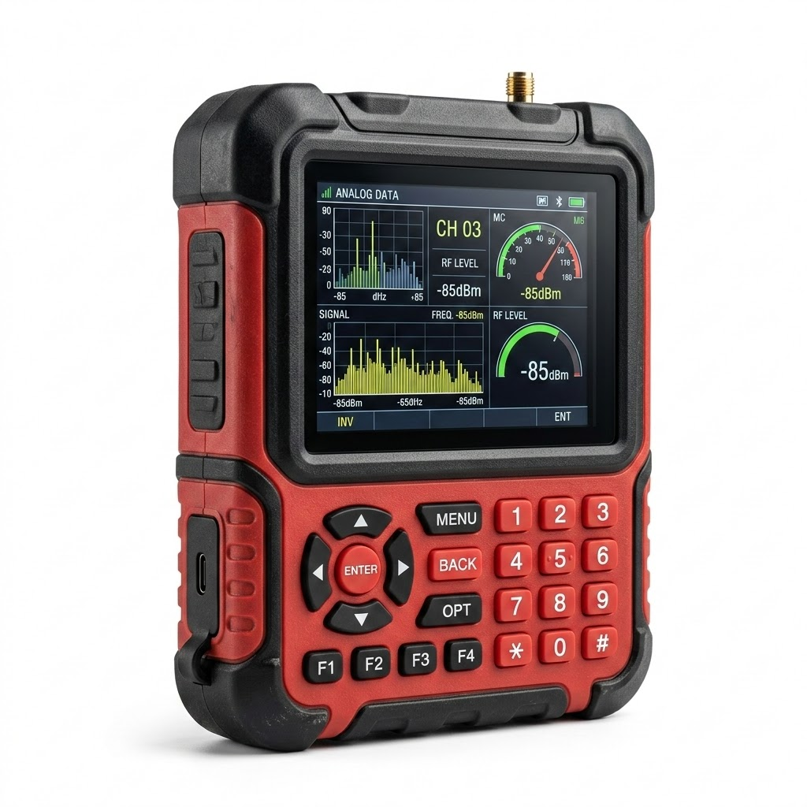
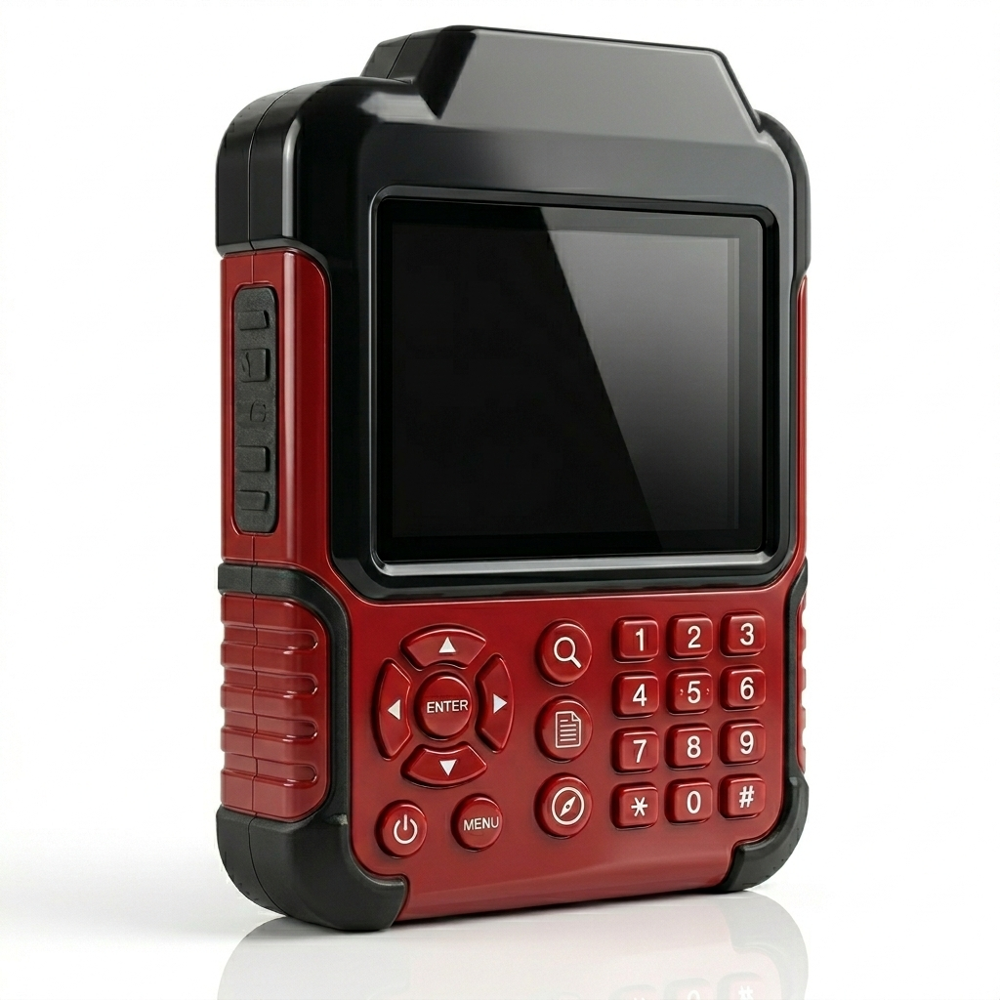
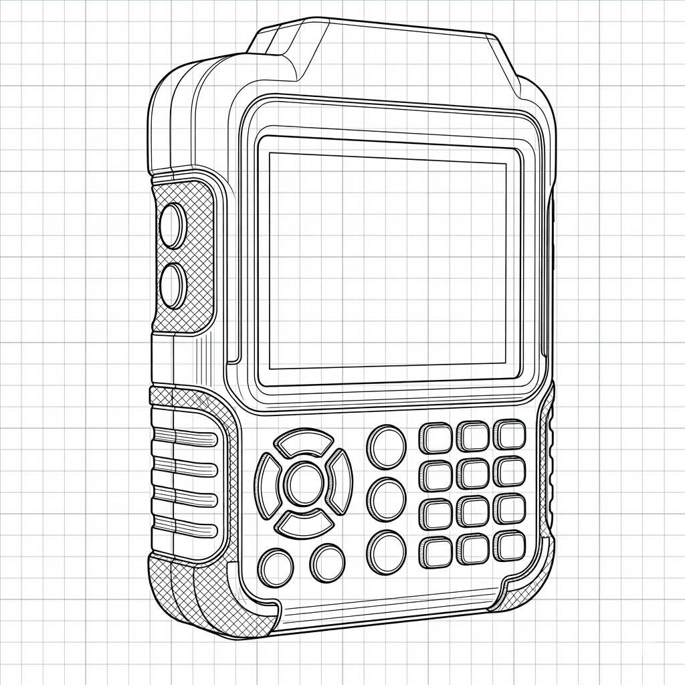

# Bird-Boy Product Showcase

The Bird-Boy is a conceptual handheld device for which I created an entire product website via Docusaurus. I meant for the project to combine a multivaried skillset of marketing, branding, technical writing, and design into a cohesive product identity. You can check out the actual website [here](https://bird-boy.brett-studer99.workers.dev/), which will include the following assets (I developed all of them personally):

* Website architecture, including a fleshed-out landing page, using Docusaurus framework
* Conceptual product render and lifestyle photography images, constructed with Google Gemini and Adobe Photoshop
* Technical user docs that showcase the device's functionality and troubleshooting
* Promotional blog articles that highlight the device's key use cases
* Mission statement from the product manufacturer that serves as an extension of the brand identity
* Style and branding guide which adds cohesiveness to the entire site across all its properties

## Conception

As a long-time outdoors enthusiast, I have been using handhelds and apps to track research projects, as well as in my personal hobbies as well. I know I'm not the only one. Species tracking apps like [Merlin Bird ID](https://merlin.allaboutbirds.org/) as well as recreational games like [Geocaching](https://www.geocaching.com/play) and [Pokémon Go](https://www.pokemongo.com/) have all gathered avid user bases who represent a demographic interested in expanding their knowledge of biodiversity or just gamifying the great outdoors. From there, I conceived an all-in-one package for all types of users: birders, foragers, students, and researchers alike.

## Execution

Before developing the web content, I wanted to focus on product rendering mockups to visually reflect the device's functionality and use cases. I used Google Gemini's Nano Banana 2 for this process. Early mockups looked like a piece of construction site or warehouse facility equipment; too technical and too bland. Other designs appeared too sleek and delicate, not like something that could withstand a slog through the rain and the mud.

  

  

  

What appealed to me were tactile textures, rubber and silicone coming together to form the exterior, and physical buttons that could outperform touch screens under harsh conditions. I used Adobe Photoshop to touch up product photography. These renderings would be a critical part of the project, manifesting ephemeral notions into a tangible direction for the rest of the project.

From there, I used the initial product render to build the marketing and lifestyle photography cache. I used Google Gemini to build a dedicated campaign for this product. Now audiences wouldn't just see a proof of concept, they would see the real-world applications of this device. Families with small children huddled around the device, an elderly couple using the device from the comfort of their home, friends trekking through the rain: all of these different demographics now had a place in our target audience. Accessibility and discovery were two of the biggest themes in creating all the assets for the site.

By establishing key branding colors, fonts, and messaging, I was able to develop the landing page and other web resources. The docs began to come alive as I explored the different use cases for the device. While I opted out of a full UI showcase, there is a cohesion of the different apps within the device, working together to make your adventures something special and memorable. The three key device modes: Maps, Database, and Discover, all unite to build a network of environmental information that users can share. The blog helped personalize the brand's style as well.

### Development Stack

| Asset/Function | Description |
|---|---|
| Site generation | GitHub, Docusaurus |
| Web hosting | Cloudflare Pages |
| Image generation | Google Gemini, Adobe Photoshop |
| Docs + blog | Google Gemini, Markdown |
| Landing page | Claude Code, HTML + CSS |

## Results

In its final stages, I'm very excited that I was able to bring concepts of an app into a fully-fledged concept piece for hardware with its own technical docs and brand awareness. I specifically avoided modern web layouts and aesthetics, or other design choices that felt cliche, including for the device itself. The result is a look that feels retro, sharp, and ultimately classic. I was very excited to complete this project and hope you enjoyed learning more about it.
