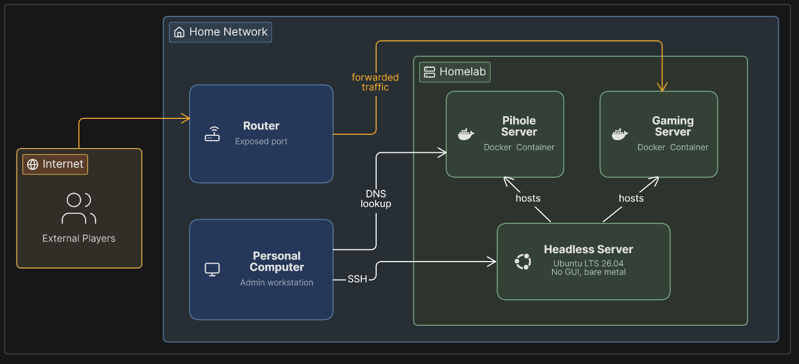

# Bare-Metal Linux Homelab with Gaming Server

This homelab project was a personal favorite for me, getting to learn key development tooling in a hands-on, real-world use case. I dug out my old college laptop, which had been gathering dust for several years now, and decided it would make the perfect sample for this project.

{: .dia-dark }

This diagram represents all the key components of the project and their interactions:

* **Headless server**: A recycled laptop running Ubuntu with no GUI. Serves as the host for all gaming/media deployments, as well as firewall configurations and other security provisions.
* **Gaming server**: A Docker Compose image which deploys a Minecraft server with a player whitelist and routine backups.
* **Pi-hole server**: A separate Docker Compose image which deploys a network-wide ad-blocker, configured at a device level via DNS configuration.
* **Personal computer**: My own personal desktop which connects to the server via SSH. This is the master workstation for all parts of this project, not the server itself.
* **Router**: Home network router which procures a static IP + port for external traffic.
* **External players**: Anyone outside of the home network will only be able to connect to the gaming server, and no other parts of the homelab.

## Repurposing Old Hardware

I started by wiping the device completely and installing an Ubuntu LTS 26.04 server. My plan was to leave the server running while the laptop remained shut and tucked away (as it already had been up to this point). It would make the perfect foundation for a collection of small, self-hosted services including media and gaming servers. This project became a practical exercise in Linux administration, home networking, and the kind of layered security thinking that's expected of anyone exposing a personal server to the public internet. I configured the machine to run headless, lid closed, where it could be remotely accessed through my desktop, and from there, I was free to start building, and my first project was a standard Minecraft server.

## Standing Up the Gaming Server

With a stable, always-on Linux host in place, I containerized a Minecraft server using Docker Compose. This made it trivial to persist world data across rebuilds, set resource limits appropriate for the hardware, and configure automatic restarts so the server recovers cleanly after a reboot or outage. The server is set to a max usage of 4 GB, and during testing with multiple players, stayed within this limitation without any noticeable performance issues.

This is the working container image:

```
services:
  minecraft:
    image: itzg/minecraft-server
    container_name: minecraft
    ports:
      - "XXXXX:XXXXX" # Hiding the ports for security reasons
    environment:
      EULA: "TRUE"
      TYPE: "NEOFORGE"
      VERSION: "26.2"
      MEMORY: "4G" # Limitation on memory usage to ensure server does not impact other services
      DIFFICULTY: "hard"
      MAX_PLAYERS: "16"
      OPS: "my_username" # Admin privileges to my account
      ENFORCE_WHITELIST: "TRUE"
      WHITELIST: "my_username,friend_username1,friend_username2,friend_username3"
      ENABLE_RCON: "true"
      RCON_PASSWORD: "XXXXXX"
      SEED: "869159556220025427"
    volumes:
      - ./data:/data
      - ./mods:/data/mods # Leverages a few server-side mods (requiring no client-side configuration)
    restart: unless-stopped
    stdin_open: true
    tty: true
```

### Exposing a Home Server Safely

In order to let friends outside my network access the server, I had to take proper precaution to ensure my network wasn't haphazardly being exposed to the outside world. I opted for direct port forwarding, paired with dynamic DNS so the server stays reachable even when the ISP changes the public IP.

### A Layered Security Approach

Opening a port to the internet means accepting it will be found and probed automatically, so I treated security as overlapping layers rather than one control. At the router, the exposed port was deliberately different from the game's default. On the host, a firewall denied all incoming traffic by default, SSH access was switched entirely to key-based authentication, and an intrusion-prevention tool auto-blocked hosts showing repeated failed logins. At the application layer, only pre-approved accounts can join via whitelisting, and Minecraft's ownership verification blocks spoofed logins even from a valid-looking username. Automated, rolling daily backups guard against data loss from any failure in the other layers.

## Other Tooling and Functionality

### Status Monitoring with htop

Htop is an interactive process viewer similar to Windows' Task Manager. With htop, I can keep a closer eye on the server's CPU and memory consumption, ensuring I stay within the constraints of my hardware, and that excess consumption does not create performance problems.

### Ad-Blocking for Local Devices

By deploying a Pi-hole container image through my homelab, I can configure DNS connectivity for individual devices in my network to block ads. Pi-hole is very lightweight, especially for only managing a couple specific devices in my network, and can run with the limited memory of my hardware.

## Key Takeaways

This project reinforced that self-hosting isn't just about getting a service running, it's about reasoning through what happens once it's reachable from the open internet. Troubleshooting both common and subtle errors along the way, weighing trade-offs of opposing security measures, and building defense-in-depth around a genuinely exposed service are the same fundamentals that show up in production infrastructure work, just at homelab scale.
