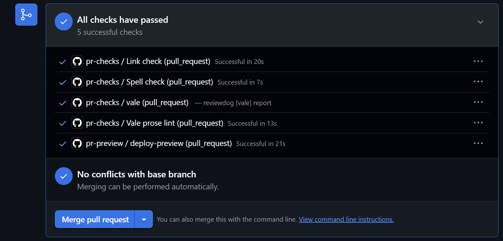

# Quality-Gating My Own Portfolio

This portfolio doesn't just describe docs-as-code work I've done elsewhere, it runs on the same principles. Every pull request against this repo passes through a set of automated checks before it can merge, plus a live preview deploy so reviewers can visually review changes, not just a source diff.

## Full Toolchain

### Spellchecking (cspell.json)

A [cspell](https://cspell.org/) configuration checks every Markdown file in `docs/` (and the README) against the standard `en_US` dictionary plus `softwareTerms` and `misc` word lists. On top of that baseline sits a custom word list of roughly 90 entries: proper nouns (Kubecost, MobiledgeX, OpenMRS), acronyms (IaC, GKE, WYSIWYG), tool names (Statamic, Pandoc, SnagIt), and some specific domain terminology for certain writing samples. That custom list matters as much as the dictionary itself: without it, genuinely correct but uncommon terms would drown out real typos in a wall of false positives.

### Link Checking (lychee.toml)

[Lychee](https://lychee.cli.rs/) checks every link in the *built* HTML output rather than the raw Markdown source, because MkDocs rewrites relative paths (like `../images/...`) to match each page's actual output directory. Checking source directly would flag perfectly valid links as broken. The config also tunes retries and timeouts, sets a browser-like user agent (some sites, like Merlin Bird ID, block the default bot user agent outright), and explicitly excludes a short list of real, live sites I've manually verified reject automated requests regardless of user agent, so those don't mask genuine breakage elsewhere.

### Terminology Consistency (Terminology.yml)

A [Vale](https://vale.sh/) substitution style, which I wired in through `.vale.ini`, enforces consistent product-name casing across the whole site, for example, `MkDocs` instead of `Mkdocs`, `GitHub` instead of `Github`, `GitBook` instead of `Gitbook`. It runs at error level, so a casing slip fails the check the same way a broken link would.

### Orchestration and Previews (pr-checks.yml, pr-preview.yml)

`pr-checks.yml` runs the spellcheck, link check, and prose lint as parallel jobs on every pull request targeting `main`, reporting results directly as GitHub checks on the PR. Separately, `pr-preview.yml` builds the site and deploys it to a per-PR preview URL on open or update, then tears that preview down automatically when the PR closes, keeping the production `gh-pages` deploy untouched in the meantime.

### Passive Voice Detection

In broad compliance with ASD-STE100 (Simplified Technical English), I've also implemented retroactive checks via Claude Code for passive voice, and worked to resolve all instances with clear, definitive language. This is the only feature which I did not implement on a scheduled interval or directly into pull requests, but is nevertheless an important function of maintaining docs.

## Key Takeaways

Here is a screenshot of the aforementioned toolchain working successfully:

{: .dia-dark }

None of these checks are about catching dramatic failures. They're about catching the small, easy-to-miss ones: a typo that slips past a quick read-through, a link that quietly rots after a page gets renamed, a product name spelled two different ways on two different pages. In isolation, each of these is minor. Across a growing site, left unchecked, they erode the thing that makes documentation useful in the first place: the reader's trust that what they're reading is accurate and current. Automating these gates means that trust doesn't depend on a human catching every issue by eye before every merge, which is exactly the discipline that makes docs-as-code work at scale.
